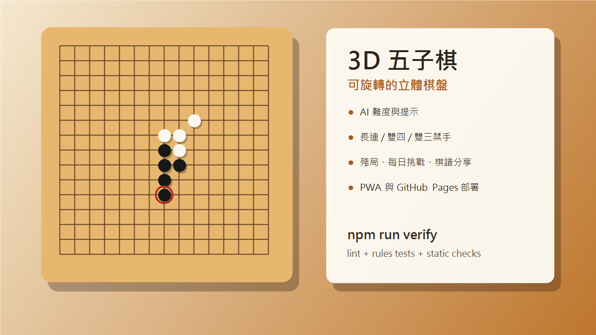

# 3D 五子棋

可部署到 GitHub Pages 的 3D 立體感五子棋網頁遊戲。專案是純前端 PWA，不需要後端伺服器。



## 功能

- 9×9、13×13、15×15、19×19 棋盤
- 單人對 AI、本機雙人、PeerJS 線上對戰
- 3D 棋盤旋轉、俯仰、縮放與自動旋轉
- 黑棋禁手：長連、雙四、雙三
- 計時、悔棋、重做、AI 提示
- 棋譜匯入、匯出、分享連結與回放
- 殘局解謎、每日挑戰、戰績與成就
- PWA 安裝支援，可加入手機主畫面

## 本機預覽

請不要直接用 `file://` 開啟，PWA 與 ES module 需要本機伺服器或 HTTPS。

```bash
python -m http.server 8000
```

然後開啟：

```text
http://localhost:8000
```

## 測試與檢查

這個專案不需要安裝 npm 套件，直接用 Node.js 內建能力檢查即可。

```bash
npm run lint
npm test
npm run verify
```

目前測試覆蓋：

- JavaScript 語法檢查
- manifest、service worker、README、`.gitignore` 靜態檢查
- 黑棋禁手規則：合法五連、長連、雙四、雙三
- AI 評分使用的威脅分析分數

## 部署到 GitHub Pages

專案已內建 GitHub Actions workflow：

- `.github/workflows/deploy-pages.yml`

部署步驟：

1. 把整個專案推到 GitHub repository。
2. 到 GitHub 的 `Settings > Pages`。
3. 在 `Build and deployment` 中確認來源使用 `GitHub Actions`。
4. 推送到預設分支後，GitHub 會自動部署。

## 主要檔案

- `index.html`
- `style.css`
- `script.js`
- `game-rules.js`
- `manifest.webmanifest`
- `service-worker.js`
