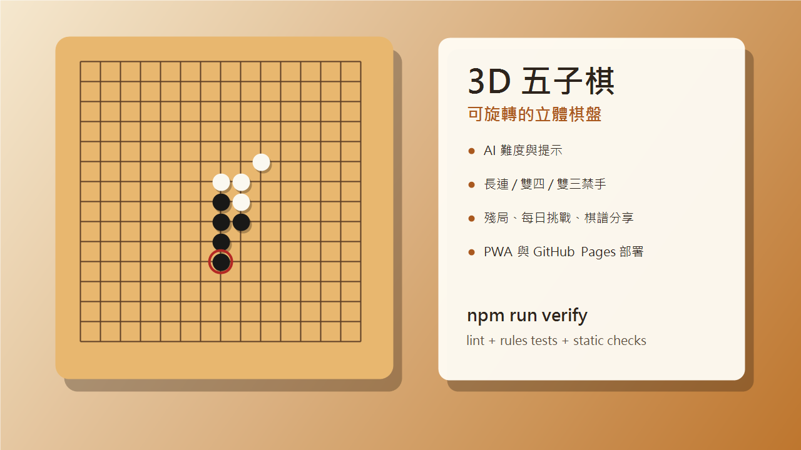

# 3D 五子棋

可部署到 GitHub Pages 的 3D 立體感五子棋網頁遊戲。專案是純前端 PWA，不需要後端伺服器。



## 功能

- 9×9、13×13、15×15、19×19 棋盤
- 單人對 AI、本機雙人、PeerJS 線上對戰
- 3D 棋盤旋轉、俯仰、縮放與自動旋轉
- 黑棋禁手：長連、雙四、雙三
- 計時、悔棋、重做、AI 提示
- 棋譜匯入、匯出、分享連結與回放
- 殘局解謎：75 題、四級（入門 16／進階 16／高手 23／大師 20），連續衝四、活三＋衝四、守備三種題型，
  每題由解題器證明可解且步數精確；步數限制、最頑強防守、走錯立刻判負可重試、三級星等與進度、`?puzzle=<id>` 分享連結
- 每日挑戰：每天一組 3 題（暖身→標準→挑戰）從題庫抽、全世界同一組、三題全破才算破了今天，`?daily` 可直接進入
- 戰績與成就
- PWA 安裝支援，可加入手機主畫面

## 本機預覽

請不要直接用 `file://` 開啟，PWA 與 ES module 需要本機伺服器或 HTTPS。

```bash
python -m http.server 8000
```

然後開啟：

```text
http://localhost:8000
```

## 測試與檢查

這個專案不需要安裝 npm 套件，直接用 Node.js 內建能力檢查即可。

```bash
npm run lint
npm test
npm run verify
```

目前測試覆蓋：

- JavaScript 語法檢查
- manifest、service worker、README、`.gitignore` 靜態檢查
- 黑棋禁手規則：合法五連、長連、雙四、雙三
- AI 評分使用的威脅分析分數
- 殘局解題器（`tests/puzzle-solver.test.mjs`）：一手成五、活三兩步、四三三步、擋點判定、反衝四、預算用完誠實回報
- 殘局題庫逐題重證（`tests/puzzles.test.mjs`）：每一題重新證明「target 步必勝且 target-1 步殺不了」、正解首手數、守備題擋點數、id 雜湊對得上局面
- 每日抽題（`tests/daily-picker.test.mjs`）：未來 400 天逐日驗三題不重複、階梯 tier 正確、同一天兩次相同

### 殘局題庫怎麼重生／補題

`puzzles.js` 是 `scripts/gen-puzzles.mjs` 產生的，**不要手改**。題目 id 是局面的內容雜湊，重生或補題都不會讓玩家的進度跑到別題身上。

```bash
npm run puzzles                    # 全部重生：≈ 12 分鐘；種子 + 局數決定結果，可重現
npm run puzzles:more -- 20260903   # 補題：保留現有每一題，只補配額還缺的桶（換個種子多跑幾次就能補滿）
npm test                           # 新題庫逐題重證
```

每次生成／補題都記在 `puzzles.js` 的 `PUZZLE_META.runs`。

真瀏覽器冒煙（不在 `npm test` 裡，要借一份 Playwright）：

```bash
python -m http.server 8765 --bind 127.0.0.1
node scripts/smoke-puzzles.mjs                        # 本機
BASE=https://5-chess.pages.dev/ node scripts/smoke-puzzles.mjs   # 線上
```

## 部署

正式站：<https://5-chess.pages.dev>（Cloudflare Pages）

推送到 `main` 之後，`.github/workflows/deploy-cloudflare.yml` 會先跑 `npm run verify`，
再用 wrangler 部署到 Cloudflare Pages。

要在本機手動出一版：

```bash
npm run deploy      # = verify → stage → wrangler pages deploy .deploy
```

`npm run stage` 會把要上線的檔案整理進 `.deploy/`。
**哪些檔案會上線，一律以 `scripts/stage.mjs` 為準**，不要另外手抄清單。

改了 `index.html` / `style.css` / `script.js` / `game-rules.js`，
**務必同時 bump `service-worker.js` 的 `CACHE_NAME`**（快取是 cache-first，
不 bump 的話已安裝的 PWA 會一直用舊版），`tests/static.test.mjs` 內的版本號要一起改。

### 啟用自動部署需要的設定

到 repo 的 `Settings → Secrets and variables → Actions` 新增兩個 secret：

| Secret | 內容 |
| --- | --- |
| `CLOUDFLARE_API_TOKEN` | Cloudflare API token，權限選 `Account → Cloudflare Pages → Edit` |
| `CLOUDFLARE_ACCOUNT_ID` | Cloudflare 儀表板網址裡那串 32 位十六進位 |

**還沒設好之前，CI 仍然是綠的**——部署那一步會自動跳過，只跑驗證。

### 舊網址

`https://5-chess.netlify.app` 已於 2026-09-01 改為 301 轉址到 pages.dev，
Netlify 端的自動建置已停止。舊連結與已安裝的舊 PWA 靠這個轉址繼續可用。

## 主要檔案

- `index.html`
- `style.css`
- `script.js`
- `game-rules.js`
- `puzzle-solver.js`（殘局解題器，生成／測試／瀏覽器共用）
- `puzzles.js`（殘局題庫，自動產生）
- `daily-picker.js`（每日挑戰抽題）
- `manifest.webmanifest`
- `service-worker.js`
